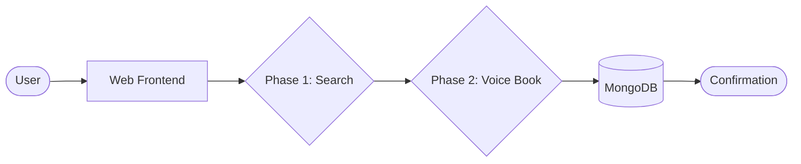
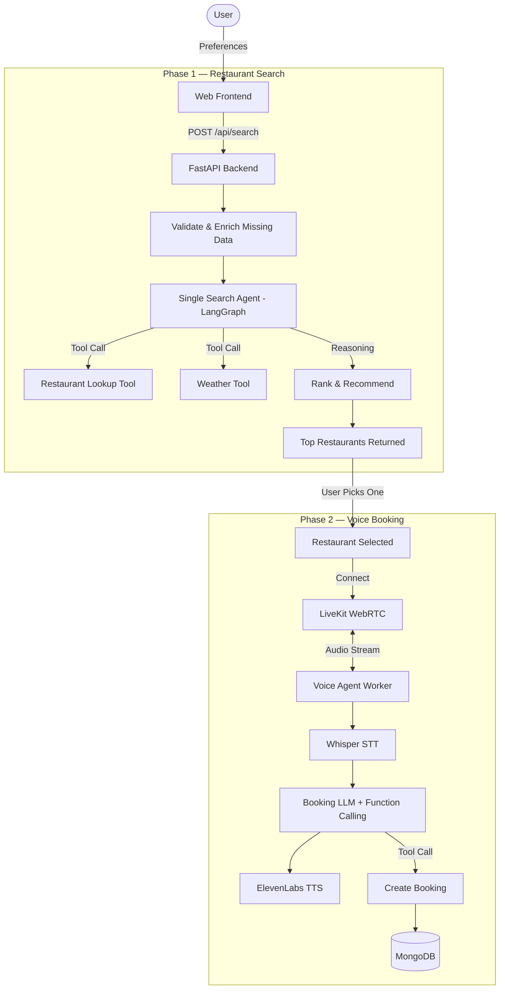
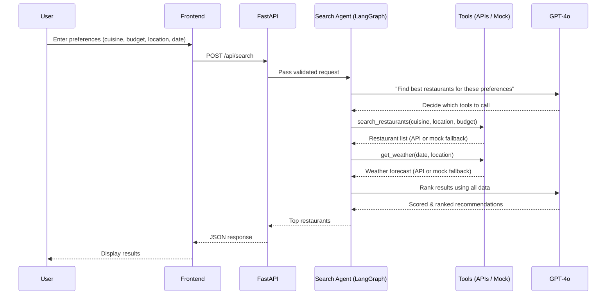
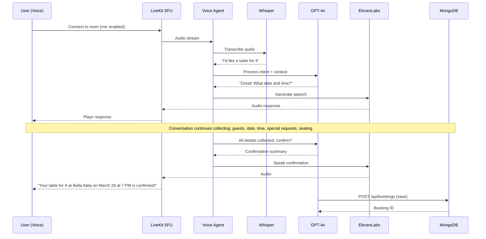
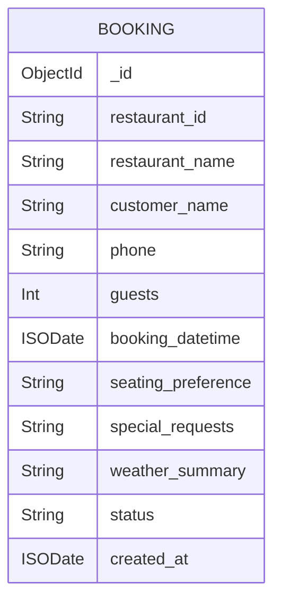
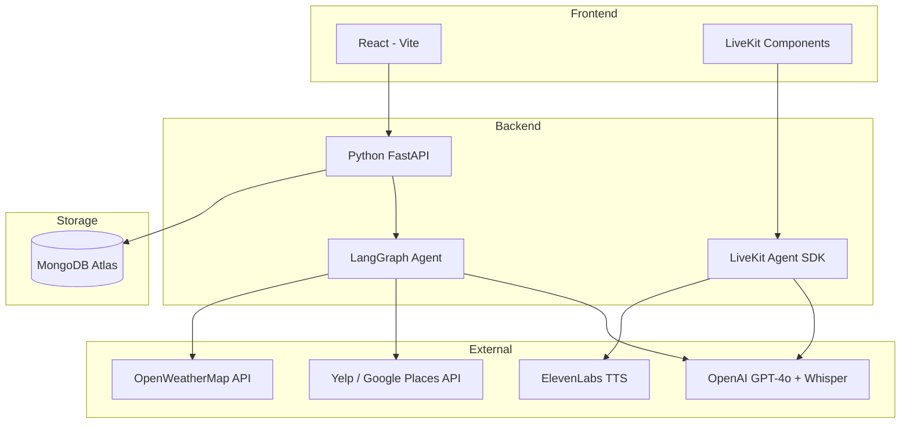

# 🍽️ Restaurant Booking AI Agent — Architecture

A two-phase intelligent system that **finds the perfect restaurant** and then **books a table through a voice agent**.

---

## High-Level Architecture



---

## Detailed System Flow



---

## Phase 1 — Restaurant Search

### Request Flow



### Single Agent with Tools

One LangGraph agent handles everything — no sub-agents needed:

| Tool | Purpose | Fallback |
|------|---------|----------|
| `search_restaurants` | Find restaurants by cuisine, location, budget, dietary needs | LLM-generated mock data |
| `get_weather` | Fetch weather forecast for the booking date | LLM-generated mock data |

> **Fallback Mechanism**: If an external API key is missing or a call fails, the tool automatically returns realistic LLM-generated mock data so the pipeline never breaks.

---

## Phase 2 — Voice Booking

### Conversation Flow



### Voice Stack

| Component | Technology |
|-----------|------------|
| WebRTC SFU | LiveKit Cloud |
| Speech-to-Text | OpenAI Whisper |
| LLM | GPT-4o (function calling) |
| Text-to-Speech | ElevenLabs |
| VAD | LiveKit Agents built-in |

---

## API Endpoints

| Method | Endpoint | Description |
|--------|----------|-------------|
| `POST` | `/api/search` | Phase 1 — Search & rank restaurants |
| `POST` | `/api/bookings` | Create a new booking |
| `GET` | `/api/bookings` | List all bookings |
| `GET` | `/api/bookings/{id}` | Get a specific booking |
| `DELETE` | `/api/bookings/{id}` | Cancel a booking |

---

## Database Schema (MongoDB)

### `bookings` Collection



```json
{
  "_id": "ObjectId",
  "restaurant_id": "String",
  "restaurant_name": "String",
  "customer_name": "String",
  "phone": "String",
  "guests": "Int",
  "booking_datetime": "ISODate",
  "seating_preference": "Indoor / Outdoor",
  "special_requests": "String",
  "weather_summary": "String",
  "status": "Confirmed / Cancelled",
  "created_at": "ISODate"
}
```

---

## Tech Stack



---

## Project Structure

```
Planner-ai/
├── main.py                  # FastAPI entry point
├── requirements.txt
├── .env.example
├── agents/
│   ├── search_agent.py      # LangGraph search agent
│   └── voice_agent.py       # LiveKit voice booking agent
├── tools/
│   ├── restaurant_tool.py   # Restaurant lookup (API + mock)
│   └── weather_tool.py      # Weather lookup (API + mock)
├── models/
│   └── schemas.py           # Pydantic models
├── db/
│   └── mongo.py             # MongoDB connection & CRUD
├── frontend/                # React app
│   ├── src/
│   └── package.json
└── ARCHITECTURE.md          # This file
```
